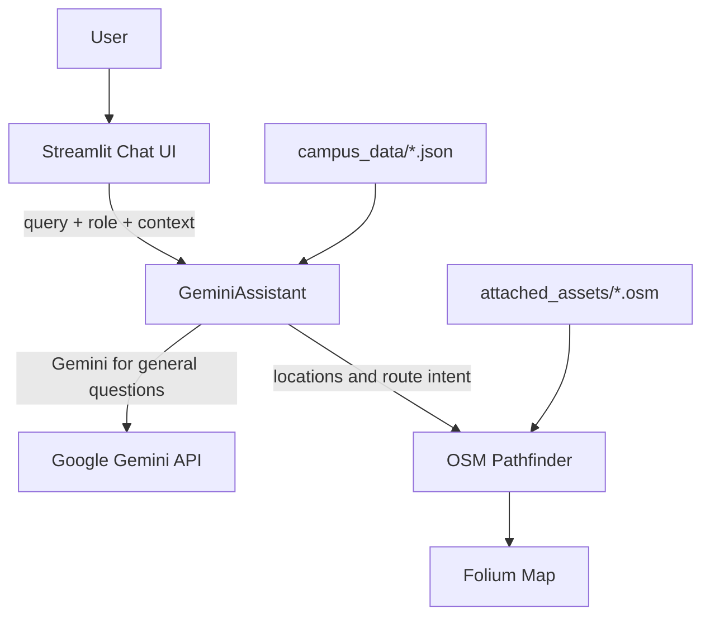

# CampusAI – Inclusive Smart Campus Copilot

[](https://python.org)
[](https://streamlit.io)
[](https://ai.google.dev/)

CampusAI is an inclusive smart-campus navigation assistant. It combines OpenStreetMap data, graph-search routing, accessibility-aware navigation, and a role-aware Gemini chat interface in a Streamlit application.

## Features

- **Natural-language routing:** Ask for directions between campus locations and display the route on the map.
- **Role-aware assistance:** Responses can be tailored for students, faculty, visitors, security, maintenance, and support staff.
- **Accessibility support:** Campus data records accessibility attributes that can be used by the routing experience.
- **Interactive mapping:** Folium and Streamlit render campus maps and route results.
- **Algorithm comparison:** Evaluate BFS, DFS, UCS, and A* variants.
- **Offline fallback:** Location lookup, routing intent parsing, and campus information remain available without a Gemini key.

## Architecture



## Local setup

### Prerequisites

- Python 3.11 or newer
- `uv` recommended, or a standard Python virtual environment

### Install and run

```bash
git clone https://github.com/jothikrishna1709-coder/CampusAI.git
cd CampusAI
uv sync
uv run streamlit run app.py
```

For a Gemini-enabled experience, set the API key as an environment variable:

```bash
# macOS/Linux
export GEMINI_API_KEY="your-gemini-api-key"

# Windows PowerShell
$env:GEMINI_API_KEY = "your-gemini-api-key"
```

Never commit `secrets.toml`, `.env`, or API keys. Use environment variables locally and Render's secret environment-variable settings in production.

## Testing

Run the automated tests and syntax checks with:

```bash
uv run pytest -q
uv run python -m compileall -q app.py src
```

## Deploy on Render

The repository includes a [`render.yaml`](render.yaml) Blueprint for a free Render web service. In the Render dashboard, choose **New → Blueprint**, connect `jothikrishna1709-coder/CampusAI`, and deploy the detected service.

Add the following environment variable in the Render service settings:

| Variable | Required | Purpose |
| --- | --- | --- |
| `GEMINI_API_KEY` | Optional | Enables Gemini-powered general campus answers; location parsing and offline fallback still work without it. |
| `PLANET_API_KEY` | Optional | Enables any Planet-specific integrations used by the deployment. |

The service binds to Render's `$PORT` value and exposes the Streamlit health endpoint at `/_stcore/health`. Automatic deploys are enabled for pushes to `main`.

## Project structure

| Path | Purpose |
| --- | --- |
| `app.py` | Streamlit application entry point |
| `src/ai_assistant.py` | Role-aware assistant, location matching, and Gemini integration |
| `src/pathfinding.py` | OSM graph loading and routing algorithms |
| `src/ui/` | Chat, navigation, home, sidebar, and facilities views |
| `campus_data/` | Campus locations and role definitions |
| `attached_assets/` | OSM campus map data and supporting assets |
| `tests/` | Automated unit tests |
| `render.yaml` | Render deployment Blueprint |

## Security note

If an API key has ever been committed to Git history or pasted into a public issue, rotate it in [Google AI Studio](https://aistudio.google.com/) and update the replacement value only in Render's environment settings.

## License

This project is licensed under the MIT License. See [LICENSE](LICENSE).
